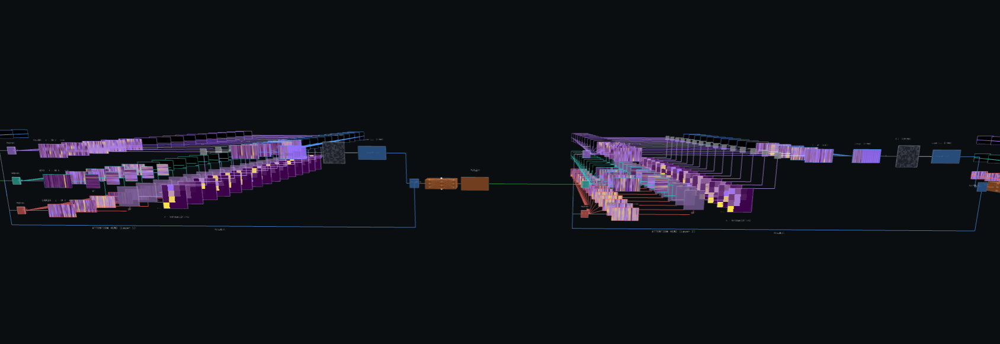

# ⚡ LLM Visualization — SmolLM2-360M

An interactive 3D visualization of a transformer language model's internals, built with **Streamlit** and **Three.js**. Watch a real neural network process your prompt in real time — from tokenization to final prediction.



## What It Visualizes

The app breaks down the entire forward pass of **SmolLM2-360M** (360M parameter transformer) into four interactive steps:

### Step 1 — Tokenization & Embedding
- Input text is split into tokens using the model's tokenizer
- Each token is mapped to a high-dimensional embedding vector
- Visualized as a 3D embedding matrix

### Step 2 — Transformer Layers (×32)
Each of the 32 transformer layers is rendered in 3D showing:
- **RMSNorm** — Input normalization with learnable scale/shift parameters
- **Multi-Head Attention** — All attention heads stacked in isometric 3D view
  - Q, K, V projection matrices per head
  - K^T transpose operation
  - QK^T dot-product attention scores
  - Softmax attention pattern heatmaps (seq × seq)
  - Output O = AV computation
- **Concatenation** of all head outputs → W_O projection
- **Add + Norm** residual connections
- **Feed-Forward MLP** with neural network visualization

### Step 3 — Token Energy Analysis
- **Energy per Token** — L2 norm of each token's final hidden state, showing which tokens the model focuses on most (blue = low energy, orange = high energy)
- **Hidden State Energy per Layer** — How the total energy evolves across all 32 layers

### Step 4 — The AI Speaks
- Final layer normalization, unembedding (LM Head), and softmax
- Raw logit bars vs probability bars for top-5 predictions
- Typewriter-style generation of the full model response

## Tech Stack

| Component | Technology |
|-----------|------------|
| Frontend | Three.js (3D), HTML Canvas, SVG charts |
| Backend | PyTorch, HuggingFace Transformers |
| App Framework | Streamlit |
| Model | SmolLM2-360M (local) |

## Project Structure

```
├── visualizer.py        # Streamlit entry point
├── html_builder.py      # HTML/CSS/JS visualization template generator
├── model_runner.py      # Model inference & data extraction
├── chat_terminal.py     # Terminal interface to send prompts
├── download_model.py    # Script to download SmolLM2-360M locally
├── .gitignore
└── smollm_local/        # Local model weights (gitignored)
```

## Getting Started

### 1. Install Dependencies
```bash
pip install streamlit torch transformers streamlit-autorefresh
```

### 2. Download the Model
```bash
python download_model.py
```

### 3. Run the App
Open two terminals:

```bash
# Terminal 1 — Start the dashboard
streamlit run visualizer.py
```

```bash
# Terminal 2 — Send prompts
python chat_terminal.py
```

Type a prompt in the chat terminal and watch the 3D visualization update on the Streamlit dashboard at `http://localhost:8501`.